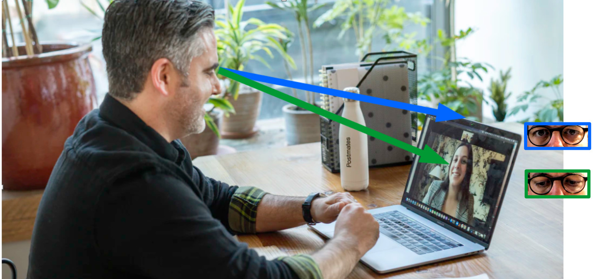

# Sight corrector
Adjusts the eyes' view direction during webcam meetings

## Description
In webmeetings, people usually look at the monitor, not at the wecam. This gives the talk partner the impression not being looked at. This software corrects the misalignment at the talk partner's side.
In a first step, a short video sequence is recorded during which the user looks into the webcam while moving the head sideways and up and down. This step records "reference eyes" for later use. In the subsequent webmeeting, the eyes with the wrong sight direction are replaced by these "reference eyes".



The result is displayed in a separate window and can be transmitted by screen sharing.


## Installation
The software was tested under 64-bit Ubuntu 20.04 with Python 3.7.6. It is recommended to create a virtual environment:

```
download the project files into a separate directory
cd to this directory
python3 -m venv ./venv
source ./venv/bin/activate
pip install --upgrade pip
pip install -r requirements.txt
```


## Usage

`python sico.py`

